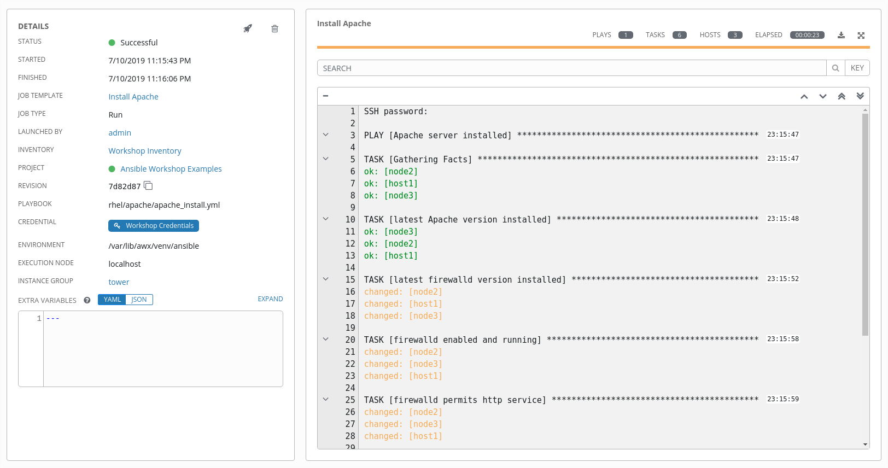

# ワークショップ演習 - プロジェクトとジョブテンプレート

**その他の言語はこちらをお読みください。**
<br> [English](README.md),  [日本語](README.ja.md),  [Portugues do Brasil](README.pt-br.md),  [Française](README.fr.md),  [Español](README.es.md).

## 目次

* [目的](#objective)
* [ガイド](#guide)
* [Git リポジトリーのセットアップ](#setup-git-repository)
* [プロジェクトの作成](#create-the-project)
* [ジョブテンプレートの作成とジョブの実行](#create-a-job-template-and-run-a-job)
* [チャレンジラボ: 結果のチェック](#challenge-lab-check-the-result)
* [練習してみましょう。](#what-about-some-practice)

## 目的

Ansible Tower **Project** は、AnsiblePlaybook
の論理的なコレクションです。プレイブックは、Git、Subversion、Mercurial などのTower がサポートするソースコード管理
(SCM) システムに配置することで管理できます。

この演習では、以下について説明します。

* AnsibleTower プロジェクトの概要と利用
* Git リポジトリーに保存されている AnsiblePlaybook の使用
* Ansible ジョブテンプレートの作成と使用

## ガイド

### Git リポジトリーのセットアップ

このデモでは、Git リポジトリーに保存されている Playbook を使用します。

[https://github.com/ansible/workshop-examples](https://github.com/ansible/workshop-examples)

Apache Web サーバーをインストールする Playbook が既に **rhel/apache** ディレクトリーにコミットされている
(`apache_install.yml`):

```yaml
---
- name: Apache server installed
  hosts: all

  tasks:
  - name: latest Apache version installed
    yum:
      name: httpd
      state: latest

  - name: latest firewalld version installed
    yum:
      name: firewalld
      state: latest

  - name: firewalld enabled and running
    service:
      name: firewalld
      enabled: true
      state: started

  - name: firewalld permits http service
    firewalld:
      service: http
      permanent: true
      state: enabled
      immediate: yes

  - name: Apache enabled and running
    service:
      name: httpd
      enabled: true
      state: started
```

> **ヒント**
>
> 作成した Playbook の違いをメモしてください。最も重要なのは、`become` がなく、`hosts` が `all` に設定されていることです。

Tower で **Source Control Management (SCM)**
として、このレポジトリーを設定して使用するには、このレポジトリーを使用する **Project** を作成する必要があります。

### プロジェクトの作成

* サイドメニュービューで **RESOURCES → Projects** に移動し、緑色の **+**
  ボタンをクリックします。フォームを記入します。

  <table>
    <tr>
      <th>Parameter</th>
      <th>Value</th>
    </tr>
    <tr>
      <td>NAME</td>
      <td>Workshop Project</td>
    </tr>
    <tr>
      <td>ORGANIZATION</td>
      <td>Default</td>
    </tr>
    <tr>
      <td>SCM TYPE</td>
      <td>Git</td>
    </tr>
  </table>

次に、リポジトリーにアクセスするための URL が必要になります。上記の Github リポジトリーに移動し、右側にある緑色の **Clone or
download** ボタンを選択し、**Use https** をクリックして、HTTPS URL をコピーします。

> **注意**
>
> リックする **Use https** がなく、**Use SSH** がある場合でも問題ありません。URL をコピーしてください。**https** で始まる URL をコピーすることが重要です。

Project 構成に URL を入力します。

 <table>
   <tr>
     <th>Parameter</th>
     <th>Value</th>
   </tr>
   <tr>
     <td>SCM URL</td>
     <td><code>https://github.com/ansible/workshop-examples.git</code></td>
   </tr>
   <tr>
     <td>SCM UPDATE OPTIONS</td>
     <td>Tick the first three boxes to always get a fresh copy of the repository and to update the repository when launching a job</td>
   </tr>
 </table>

* **SAVE** をクリックします。

新しい Project は、作成後に自動的に同期されます。ただし、これを手動で行うこともできます。**Projects**
ビューに移動し、プロジェクトの右側にある円形の矢印 *Get latest SCM revision** アイコンをクリックして、プロジェクトを Git
リポジトリーと再度同期します。

同期ジョブを開始した後、**Jobs** ビューに移動します。Git リポジトリーを更新するための新しいジョブがあります。

### ジョブテンプレートの作成とジョブの実行

ジョブテンプレートは、Ansible
ジョブを実行するための定義とパラメーターのセットです。ジョブテンプレートは、同じジョブを何度も実行するのに役立ちます。したがって、Tower から
Ansible **Job**を実行する前に、まとめる **Job Template** を作成する必要があります。

* **Inventory**: ジョブが実行するホスト

* **Credentials** ホストへのログインに必要な認証情報

* **Project**: Playbook の場所

* **What** 使用する Playbook

実際にやってみましょう。**Templates** ビューに移動して、
ボタンをクリックし、**Job Template** を選択します。

> **ヒント**
>
> フィールドへの記入を選ぶにあたり、オプションの概要を得るには拡大鏡をクリックすることができます。

<table>
  <tr>
    <th>Parameter</th>
    <th>Value</th>
  </tr>
  <tr>
    <td>NAME</td>
    <td>Install Apache</td>
  </tr>
  <tr>
    <td>JOB TYPE</td>
    <td>Run</td>
  </tr>
  <tr>
    <td>INVENTORY</td>
    <td>Workshop Inventory</td>
  </tr>
  <tr>
    <td>PROJECT</td>
    <td>Workshop Project</td>
  </tr>
  <tr>
    <td>PLAYBOOK</td>
    <td><code>rhel/apache/apache_install.yml</code></td>
  </tr>
  <tr>
    <td>CREDENTIAL</td>
    <td>Workshop Credentials</td>
  </tr>
  <tr>
    <td>LIMIT</td>
    <td>web</td>
  </tr>
  <tr>
    <td>OPTIONS</td>
    <td>tasks need to run as root so check **Enable privilege escalation**</td>
  </tr>
</table>

* **SAVE** をクリックします。

青い **LAUNCH** ボタンを直接クリックするか、Job Templates
の概要でロケットをクリックすると、ジョブを開始できます。ジョブテンプレートを起動すると、自動的にジョブの概要が表示され、Playbook
の実行をリアルタイムで追跡できます。



これには時間がかかる場合があるため、提供されているすべての詳細を詳しく調べてください。

* インベントリー、プロジェクト、認証情報、Playbook などのジョブテンプレートのすべての詳細が表示されます。

* さらに、Playbook の実際のリビジョンがここに記録されます。これにより、後でジョブの実行を分析しやすくなります。

* また、開始時間と終了時間の実行時間が記録されるため、ジョブの実行が実際にどのくらいの時間であったかがわかります。

* 右側には、Playbook
  の実行の出力が表示されます。タスクの下のノードをクリックして、各ノードの各タスクの詳細情報が表示されていることを確認します。

ジョブが終了したら、メインの **Jobs** ビューに移動します。すべてのジョブがここに一覧表示されます。Playbook が実行される前に、SCM
更新が開始されていたことがわかります。これは、起動時に **Project** 用に構成した Git アップデートです。

### チャレンジラボ: 結果を確認する

小チャレンジ:

* 両方のホストでアドホックコマンドを使用して、Apache がインストールされ、実行されていることを確認します。

必要なすべての手順をすでに完了しているので、これを自分で試してください。

> **ヒント**
>
> `systemctl status httpd` はどうでしょうか。

> **警告**
>
> **回答を以下に示します**

* **Inventories** → **Workshop Inventory** に移動します

* **HOSTS** ビューでは、すべてのホストを表示して、**RUN COMMANDS** をクリックします。

* 以下に記入してください。

<table>
  <tr>
    <th>Parameter</th>
    <th>Value</th>
  </tr>
  <tr>
    <td>MODULE</td>
    <td>command</td>
  </tr>
  <tr>
    <td>ARGUMENTS</td>
    <td>systemctl status httpd</td>
  </tr>
  <tr>
    <td>MACHINE CREDENTIALS</td>
    <td>Workshop Credentials</td>
  </tr>
</table>

* **LAUNCH** をクリックします

---
**ナビゲーション**
<br>
[前の演習](../2.2-cred) - [次の演習](../2.4-surveys)

[クリックして Ansible for Red Hat Enterprise Linux Workshop
に戻ります](../README.md#section-2---ansible-tower-exercises)
