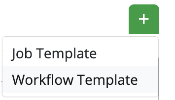
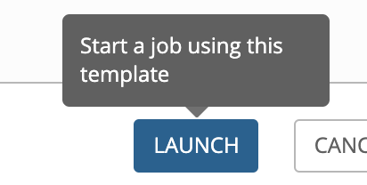

# Workshop - Flujos de trabajo

**Lee esto en otros idiomas**:
<br> [English](README.md),  [日本語](README.ja.md),  [Portugues do Brasil](README.pt-br.md),  [Française](README.fr.md),  [Español](README.es.md).

## Tabla de contenidos

* [Objetivos](#Objetivos)
* [Guía](#Guía)
   * [Escenario de laboratorio](#Escenario-de-laboratorio)
   * [Configurar Proyectos](#Configurar-Proyectos)
   * [Configurar Plantillas de trabajo](#Configurar-Plantillas-de-trabajo)
   * [Configurar el Flujos de trabajo](#Configurar-el-Flujos-de-trabajo)
   * [Iniciar flujo de trabajo](#Iniciar-flujo-de-trabajo)

# Objetivos

La idea básica de un flujo de trabajo es vincular varias plantillas de trabajo juntas. Pueden o no compartir inventario, playbooks o incluso permisos. Los enlaces pueden ser condicionales:

  - si la plantilla de trabajo A se realiza correctamente, la plantilla de trabajo B se ejecuta automáticamente después

  - pero en caso de error, se ejecutará la plantilla de trabajo C.

Y los flujos de trabajo ni siquiera se limitan a plantillas de trabajo, sino que también pueden incluir actualizaciones de proyectos o inventarios.

Esto permite nuevas aplicaciones para Ansible Tower: diferentes plantillas de trabajo pueden construirse unas sobre otras. Por ejemplo, el equipo de redes crea playbooks con su propio contenido, en su propio repositorio Git e incluso se dirige a su propio inventario, mientras que el equipo de operaciones también tiene sus propios repositorios, playbooks e inventario.

En este laboratorio aprenderá a configurar un flujo de trabajo.

# Guía

## Escenario de laboratorio

Tiene dos departamentos en su organización:

  - El equipo de operaciones web que está desarrollando playbooks en su propia rama git llamado `webops`

  - El equipo de desarrolladores web que está desarrollando playbooks en su propia rama Git llamado `webdev`.

Cuando hay un nuevo servidor Node.js para implementar, dos cosas deben suceder:

**Equipo de operaciones web**:
- node.js necesita ser instalado, el firewall necesita abrir puertos y node.js debe iniciarse.

**Equipo de desarrolladores web**
- Es necesario implementar la versión más reciente de la aplicación web.

---

Para hacer las cosas un poco más fáciles para usted, todo lo necesario ya existe en un repositorio Github: Playbooks, Arhivos JSP, etc. Sólo necesitas copiarlo y pegarlo.

> **Nota**
>
> En este ejemplo utilizamos dos ramas diferentes del mismo repositorio para el contenido de los equipos separados. En realidad, la estructura de los repositorios de SCM depende de muchos factores y podría ser diferente.

## Configurar Proyectos

En primer lugar, debe configurar el repositorio de Git como lo haría normalmente.

> **Advertencia**
>
> Si aun se encuentra logueado como usuario **wweb**, cierre la sesión e inicie sesión como usuario **admin** de nuevo.**

Cree el proyecto para el equipo de operaciones web.  En la vista **Projects**, haga clic en el + del botón verde y rellénelo de la siguiente manera:

<table>
  <tr>
    <th>Parámetro</th>
    <th>Valor</th>
  </tr>
  <tr>
    <td>NAME</td>
    <td>Webops Git Repo</td>
  </tr>
  <tr>
    <td>ORGANIZATION</td>
    <td>Default</td>
  </tr>
  <tr>
    <td>SCM TYPE</td>
    <td>Git</td>
  </tr>  
  <tr>
    <td>SCM URL</td>
    <td><code>https://github.com/ansible/workshop-examples.git</code></td>
  </tr>
  <tr>
    <td>SCM BRANCH/TAG/COMMIT</td>
    <td><code>webops</code></td>
  </tr>
  <tr>
    <td>SCM UPDATE OPTIONS</td>
    <td><ul><li>✓ CLEAN</li><li>✓ DELETE ON UPDATE</li><li>✓ UPDATE REVISION ON LAUNCH</li></ul></td>
  </tr>             
</table>

- Clic en **SAVE**

---
Cree el proyecto para el equipo de desarrolladores web. En la vista **Projects**, haga clic en el + del botón verde y rellénelo de la siguiente manera:

<table>
  <tr>
    <th>Parámetro</th>
    <th>Valor</th>
  </tr>
  <tr>
    <td>NAME</td>
    <td>Webdev Git Repo</td>
  </tr>
  <tr>
    <td>ORGANIZATION</td>
    <td>Default</td>
  </tr>
  <tr>
    <td>SCM TYPE</td>
    <td>Git</td>
  </tr>  
  <tr>
    <td>SCM URL</td>
    <td><code>https://github.com/ansible/workshop-examples.git</code></td>
  </tr>
  <tr>
    <td>SCM BRANCH/TAG/COMMIT</td>
    <td><code>webdev</code></td>
  </tr>
  <tr>
    <td>SCM UPDATE OPTIONS</td>
    <td><ul><li>✓ CLEAN</li><li>✓ DELETE ON UPDATE</li><li>✓ UPDATE REVISION ON LAUNCH</li></ul></td>
  </tr>             
</table>

- Clic en **SAVE**

## Configurar Plantillas de trabajo

Ahora tienes que crear dos plantillas de trabajo como lo harías para los trabajos "normal".

Vaya a la vista **Templates**, haga clic en + del botón verde y elija **Job Template**:

  <table>
    <tr>
      <th>Parámetro</th>
      <th>Valor</th>
    </tr>
    <tr>
      <td>NAME</td>
      <td>Web App Deploy</td>
    </tr>
    <tr>
      <td>JOB TYPE</td>
      <td>Run</td>
    </tr>
    <tr>
      <td>INVENTORY</td>
      <td>Workshop Inventory</td>
    </tr>  
    <tr>
      <td>PROJECT</td>
      <td>Webops Git Repo</td>
    </tr>
    <tr>
      <td>PLAYBOOK</td>
      <td><code>rhel/webops/web_infrastructure.yml</code></td>
    </tr>
    <tr>
      <td>CREDENTIAL</td>
      <td>Workshop Credentials</td>
    </tr>
    <tr>
      <td>LIMIT</td>
      <td>web</td>
    </tr>    
    <tr>
      <td>OPTIONS</td>
      <td>✓ ENABLE PRIVILEGE ESCALATION</td>
    </tr>                     
  </table>  

  - Clic en **SAVE**

---  

Vaya a la vista **Templates**, haga clic en el + del botón verde y elija **Job Template**:


  <table>
    <tr>
      <th>Parámetro</th>
      <th>Valor</th>
    </tr>
    <tr>
      <td>NAME</td>
      <td>Node.js Deploy</td>
    </tr>
    <tr>
      <td>JOB TYPE</td>
      <td>Run</td>
    </tr>
    <tr>
      <td>INVENTORY</td>
      <td>Workshop Inventory</td>
    </tr>  
    <tr>
      <td>PROJECT</td>
      <td>Webdev Git Repo</td>
    </tr>
    <tr>
      <td>PLAYBOOK</td>
      <td><code>rhel/webdev/install_node_app.yml</code></td>
    </tr>
    <tr>
      <td>CREDENTIAL</td>
      <td>Workshop Credentials</td>
    </tr>
    <tr>
      <td>LIMIT</td>
      <td>web</td>
    </tr>        
    <tr>
      <td>OPTIONS</td>
      <td>✓ ENABLE PRIVILEGE ESCALATION</td>
    </tr>                     
  </table>  

  - Clic en **SAVE**

> **Consejo**
>
> Si quieres saber cómo son los Playbooks de Ansible, echa un vistazo a la URL de Github y cambia a las ramas adecuadas.

## Configurar el Flujos de trabajo

Configure el flujo de trabajo. Los flujos de trabajo se configuran en la vista **Templates**, es posible que haya notado que puede elegir entre **Job Template** y **Workflow Template** al agregar una plantilla.

  

  - Vaya a la vista **Templates** y haga clic en el + del botón verde. Esta vez elija **Workflow Template**
  <table>
    <tr>
      <td><b>NAME</b></td>
      <td>Deploy Webapp Server</td>
    </tr>
    <tr>
      <td><b>ORGANIZATION</b></td>
      <td>Default</td>
    </tr>    
</table>      

  - Clic en **SAVE**

Después de guardar la plantilla, se abre el **Workflow Visualizer** para permitirle crear un flujo de trabajo. Más adelante puede abrir el **Workflow Visualizer** de nuevo mediante el botón de la página de detalles de la plantilla.

  - Haga clic en el botón **START**, se abre un nuevo nodo. A la derecha puede asignar una acción al nodo, puede elegir entre **JOBS**, **PROJECT SYNC**, **INVENTORY SYNC** y **APPROVAL**.

  - En este laboratorio enlazaremos nuestros dos trabajos juntos, así que seleccione el trabajo **Web App Deploy** y haga clic en **SELECT**.

  - El nodo se anota con el nombre del trabajo. Pase el puntero del ratón sobre el nodo, y verá un rojo **x**, un verde **+** y un símbolode**cadena**símbolo azul

  

> **Consejo**
>
> El uso de la red "x" le permite eliminar el nodo, el signo más verde le permite agregar el siguiente nodo y los vínculos de símbolo de cadena a otro nodo.

  - Haga clic en el signo verde **+**

  - Elija **Node.js Deploy** como el siguiente trabajo (es posible que tenga que cambiar a la página siguiente)

  - Deje **Type** establecido en **On Success**

> **Consejo**
>
> El tipo permite flujos de trabajo más complejos. Podría diseñar diferentes rutas de ejecución para ejecuciones exitosas y fallidas del playbook.

  - Haga clic en **SELECT**

  - Haga clic en **SAVE** en la vista **WORKFLOW VISUALIZER**

  - Haga clic en **SAVE** en la vista **Workflow Template**

> **Consejo**
>
> El **Workflow Visualizer** tiene opciones para configurar flujos de trabajo más avanzados, consulte la documentación.

## Iniciar flujo de trabajo

Su flujo de trabajo está listo para iniciarse, ejecútelo.

- Haga clic en el botón azul **LAUNCH** directamente o vaya a la vista **Templates** e inicie el flujo de trabajo **Deploy Webapp Server** haciendo clic en el icono del cohete.

  

Observe cómo se muestra la ejecución del flujo de trabajo en la vista de trabajo. A diferencia de una ejecución de trabajo de plantilla de trabajo normal esta vez, no hay ninguna salida de playbooks a la derecha, sino una representación visual de los diferentes pasos del flujo de trabajo. Si quieres ver los playbooks reales detrás de eso, haz clic en **DETAILS** en cada paso. Si desea volver de una vista de detalles al flujo de trabajo correspondiente, haga clic en el archivo  en la línea **JOB TEMPLATE** de la parte **DETAILS** en el lado izquierdo de la descripción general del trabajo.


Una vez finalizado el trabajo, compruebe si todo ha funcionado bien: inicie sesión en `node1`, `node2` o `node3` desde el host de control y ejecute:

```bash
$ curl http://localhost/nodejs
```

También puede ejecutar curl en el host de control, apuntando hacia los nodos y consultar la ruta de acceso `nodejs`, también debe mostrar la aplicación nodejs simple.


----
**Navegación**
<br>
[Ejercicio anterior](../2.5-rbac/README.es.md) - [Próximo Ejercicio](../2.7-wrap/README.es.md)

[Haga clic aquí para volver al Taller Ansible for Red Hat Enterprise Linux](../README.es.md#Sección-2---Ejercicios-de-Ansible-Tower)
