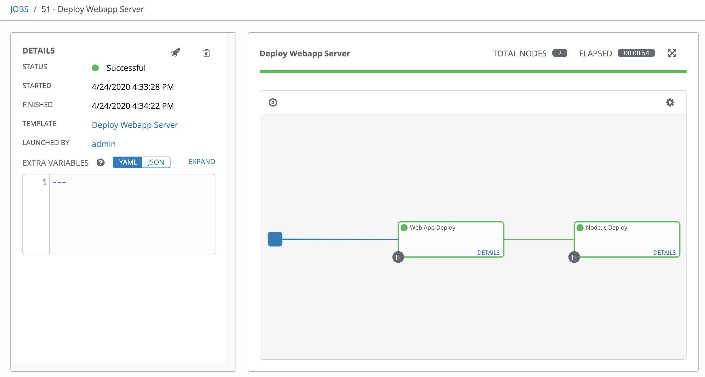

# ワークショップ演習 - ワークフロー

**その他の言語はこちらをお読みください。**
<br> [English](README.md),  [日本語](README.ja.md),  [Portugues do Brasil](README.pt-br.md),  [Française](README.fr.md),  [Español](README.es.md).

## 目次

* [目的](#objective)
* [ガイド](#guide)
  * [ラボシナリオ](#lab-scenario)
  * [プロジェクトのセットアップ](#set-up-projects)
  * [ジョブテンプレートのセットアップ](#set-up-job-templates)
  * [ワークフローのセットアップ](#set-up-the-workflow)
  * [ワークロードの起動](#launch-workflow)

## 目的

ワークフローの基本的な考え方は、複数のジョブテンプレートをリンクするというものです。インベントリー、Playbook、さらにはパーミッションを共有する場合と共有しない場合があります。リンクは条件付きにすることができます。

* ジョブテンプレート A が成功すると、その後ジョブテンプレート B が自動的に実行されます。
* ただし、失敗した場合は、ジョブテンプレート C が実行されます。

また、ワークフローは Job Templates に限定されるものではなく、プロジェクトやインベントリーの更新を含めることもできます。

これにより、AnsibleTower
の新しいアプリケーションが可能になります。さまざまなジョブテンプレートを相互に構築できます。たとえば、ネットワーキングチームは、独自のコンテンツを使用して、独自のGitリポジトリに、さらには独自のインベントリを対象に
Playbook を作成します。一方、運用チームには、独自のリポジトリー、Playbook、およびインベントリーがあります。

このラボでは、ワークフローを設定する方法を説明します。

## ガイド

### ラボシナリオ

組織に 2 つの部門があるとします。

* `webops` という独自の Git ブランチで Playbook を開発している Web 運用チーム
* `webdev` という独自の Git ブランチでプレイブックを開発しているWeb開発者チーム。

デプロイする新しい Node.js サーバーがある場合は、次の 2 つのことが必要です。

#### Web 運用チーム

* node.js をインストールし、ファイアウォールを開いて、node.js を開始する必要があります。

#### Web 開発者チーム

* Web アプリケーションの最新バージョンをデプロイする必要があります。

---

作業を少し簡単にするために、必要なものはすべて Github リポジトリーに既に存在します。Playbook、JSP
ファイルなどです。接着するだけです。

> **注意**
>
> この例では、別々のチームのコンテンツに同じレポジトリーの異なる 2 つのブランチを使用します。実際には、SCM レポジトリーの構造は、ファクターによってことなります。

### プロジェクトの設定

まず、通常どおりに Git リポジトリーをプロジェクトとして設定する必要があります。

> **警告**
>
> ユーザー **wweb** としてログインしている場合は、*admin** として再びログインします。

Web 運用チームのプロジェクトを作成します。**Project** ビューで、緑色のプラスボタンをクリックし、次のように入力します。

<table>
  <tr>
    <th>Parameter</th>
    <th>Value</th>
  </tr>
  <tr>
    <td>NAME</td>
    <td>Webops Git Repo</td>
  </tr>
  <tr>
    <td>ORGANIZATION</td>
    <td>Default</td>
  </tr>
  <tr>
    <td>SCM TYPE</td>
    <td>Git</td>
  </tr>
  <tr>
    <td>SCM URL</td>
    <td><code>https://github.com/ansible/workshop-examples.git</code></td>
  </tr>
  <tr>
    <td>SCM BRANCH/TAG/COMMIT</td>
    <td><code>webops</code></td>
  </tr>
  <tr>
    <td>SCM UPDATE OPTIONS</td>
    <td><ul><li>✓ CLEAN</li><li>✓ DELETE ON UPDATE</li><li>✓ UPDATE REVISION ON LAUNCH</li></ul></td>
  </tr>
</table>

**SAVE** をクリックします。

---
Web 開発者チームのプロジェクトを作成します。**Project** ビューで、緑色のプラスボタンをクリックし、次のように入力します。

<table>
  <tr>
    <th>Parameter</th>
    <th>Value</th>
  </tr>
  <tr>
    <td>NAME</td>
    <td>Webdev Git Repo</td>
  </tr>
  <tr>
    <td>ORGANIZATION</td>
    <td>Default</td>
  </tr>
  <tr>
    <td>SCM TYPE</td>
    <td>Git</td>
  </tr>
  <tr>
    <td>SCM URL</td>
    <td><code>https://github.com/ansible/workshop-examples.git</code></td>
  </tr>
  <tr>
    <td>SCM BRANCH/TAG/COMMIT</td>
    <td><code>webdev</code></td>
  </tr>
  <tr>
    <td>SCM UPDATE OPTIONS</td>
    <td><ul><li>✓ CLEAN</li><li>✓ DELETE ON UPDATE</li><li>✓ UPDATE REVISION ON LAUNCH</li></ul></td>
  </tr>
</table>

**SAVE** をクリックします。

### ジョブテンプレートのセットアップ

次に、「通常」ジョブの場合と同じように、2 つのジョブテンプレートを作成する必要があります。

**Template** ビューに移動し、緑色のプラスボタンをクリックして、**Job Template** を選択します。

  <table>
    <tr>
      <th>Parameter</th>
      <th>Value</th>
    </tr>
    <tr>
      <td>NAME</td>
      <td>Web App Deploy</td>
    </tr>
    <tr>
      <td>JOB TYPE</td>
      <td>Run</td>
    </tr>
    <tr>
      <td>INVENTORY</td>
      <td>Workshop Inventory</td>
    </tr>
    <tr>
      <td>PROJECT</td>
      <td>Webops Git Repo</td>
    </tr>
    <tr>
      <td>PLAYBOOK</td>
      <td><code>rhel/webops/web_infrastructure.yml</code></td>
    </tr>
    <tr>
      <td>CREDENTIAL</td>
      <td>Workshop Credentials</td>
    </tr>
    <tr>
      <td>LIMIT</td>
      <td>web</td>
    </tr>
    <tr>
      <td>OPTIONS</td>
      <td>✓ ENABLE PRIVILEGE ESCALATION</td>
    </tr>
  </table>

**SAVE** をクリックします。

---

**Template** ビューに移動し、緑色のプラスボタンをクリックして、**Job Template** を選択します。

  <table>
    <tr>
      <th>Parameter</th>
      <th>Value</th>
    </tr>
    <tr>
      <td>NAME</td>
      <td>Node.js Deploy</td>
    </tr>
    <tr>
      <td>JOB TYPE</td>
      <td>Run</td>
    </tr>
    <tr>
      <td>INVENTORY</td>
      <td>Workshop Inventory</td>
    </tr>
    <tr>
      <td>PROJECT</td>
      <td>Webdev Git Repo</td>
    </tr>
    <tr>
      <td>PLAYBOOK</td>
      <td><code>rhel/webdev/install_node_app.yml</code></td>
    </tr>
    <tr>
      <td>CREDENTIAL</td>
      <td>Workshop Credentials</td>
    </tr>
    <tr>
      <td>LIMIT</td>
      <td>web</td>
    </tr>
    <tr>
      <td>OPTIONS</td>
      <td>✓ ENABLE PRIVILEGE ESCALATION</td>
    </tr>
  </table>

**SAVE** をクリックします。

> **ヒント**
>
> Ansible Playbook がどのようなものかを見たい場合は、Github URL を確認して適切なブランチに切り替えてください。

### ワークフローの設定

ワークフローを設定します。ワークフローは **Template** ビューで構成されます。テンプレートを追加するときに、**Job Template**
と **Workflow Template** のどちらかを選択できることに気付いたかもしれません。

  

**Templates** ビューに移動して、今回は、**Workflow Template** を選択します。

  <table>
    <tr>
      <td><b>NAME</b></td>
      <td>Deploy Webapp Server</td>
    </tr>
    <tr>
      <td><b>ORGANIZATION</b></td>
      <td>Default</td>
    </tr>
  </table>

**SAVE** をクリックします。

テンプレートを保存すると、**Workflow Visualizer**
が開き、ワークフローを作成できます。テンプレートの詳細ページのボタンを使用して、後で **Workflow Visualizer**
を再度開くことができます。

* **START**
  ボタンをクリックすると、新しいノードが開きます。右側では、ノードにアクションを割り当てることができ、**JOBS**、**PROJECT
  SYNC**、**INVENTORY SYNC**、および **APPROVAL** から選択できます。

* このラボでは、2つのジョブをリンクするため、**Web App Deploy** ジョブを選択し、**SELECT** をクリックします。

* ノードには、ジョブの名前が注釈として付けられます。マウスポインターをノードに合わせると、赤い **x**、緑の ** + **、青い
  **chain** 記号が表示されます。

  

> **ヒント**
>
> 赤い "x" を使用すると、ノードを削除できます。緑色のプラスでは、次のノードを追加できます。チェーン記号は、別のノードに接続します。

* 緑の **+** 記号をクリックします
* 次のジョブとして **Node.js Deploy** を選択します (次のページに切り替える必要がある場合があります)
* **Type** は **On Success** のままにします

> **ヒント**
>
> このタイプにより、より複雑なワークフローが可能になります。Playbook 実行に成功した実行パスや失敗した実行パスなど、各種パスのレイアウトを行うことができます。

* **SELECT** をクリックします
* **WORKFLOW VISUALIZER** ビューの **SAVE** をクリックします。
* **Workflow Template** ビューの **SAVE** をクリックします。

> **ヒント**
>
> **Workflow Visualizer** には、より高度なワークフローを設定するためのオプションがあります。ドキュメントを参照してください。

### ワークフローの起動

ワークフローの準備ができました。起動します。

青い **LAUNCH** ボタンを直接クリックするか、**Templates** ビューに移動し、ロケットアイコンをクリックして **Deploy
Webapp Server** ワークフローを起動します。

  

ワークフローの実行がジョブビューにどのように表示されるかに注目してください。通常のジョブテンプレートのジョブの実行と比べ、今回のものには、右側には
Playbook の出力はありませんが、さまざまなワークフローステップの視覚的表現があります。その背後にある実際の Playbook
を見たい場合は、各ステップで **詳細** をクリックしてください。詳細ビューから対応するワークフローに戻る場合は、ジョブ概要の左側の
**DETAIS** 部分の **JOB TEMPLATE** の  をクリックします。



ジョブが終了した後、すべてが正常に動作したことを確認します。コントロールホストから `node1`、`node2`、`node3`
にログインし、以下を実行します。

```bash
#> curl http://localhost/nodejs
```

コントロールホストで curl を実行して、ノードに向けて `nodejs` パスを参照することもできます。また、単純な nodejs
アプリケーションも表示されます。

---
**ナビゲーション**
<br>
[前の演習](../2.5-rbac) - [次の演習](../2.7-wrap)

[クリックして Ansible for Red Hat Enterprise Linux Workshop
に戻ります](../README.md#section-2---ansible-tower-exercises)
